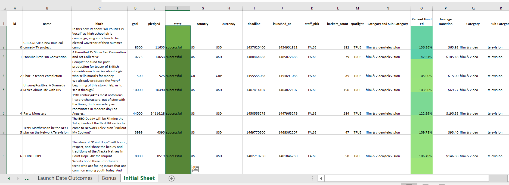
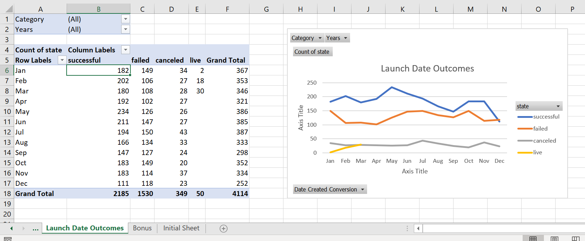

# 01-Excel-Challenge

This challenge analyzes Excel data from 4,000 past projects of the crowdfunding service Kickstarter in order to find market trends.

Conditional formatting was used to color code the project "state" column as "successful" (green), "failed" (red), "cancelled" (yellow), or currently "live" (blue).  The "Percent Funded" column was calculated and color coded on a gradient according to the percent to which the project met its goal.  Additionally, the "Average Donation" column was calculated using the inital data, and the columns of "Category" and "Sub-Category" were split from the initial data as well.
  

A new sheet with the data in a pivot table and pivot chart line graph was then made to better visualize the data.

### Conclusions:  
1.	From the dataset of 4,000 past Kickstarter projects, these trends can be drawn:

    a.	Of successful Kickstarter campaigns, the most count of successful campaigns were among the categories of Theater, Music, and Film & Video.  
    
    b.	Theater had the greatest number of successful campaigns.  Of the sub-categories of Theater, Plays had the most successful campaigns.  
    
    c.	In the total of the data set, more Kickstarter campaigns were successful than failed or cancelled.   
    
2.	What are some limitations of this dataset?  

    a.	Less than 10 years of data (The dataset is from 2009-2017, so missing most recent data if trends have changed since then)  
    
    b.	Less than 5,000 campaigns (more data can be used in future studies)  
    
    c.	We don’t know how much each backer donated

